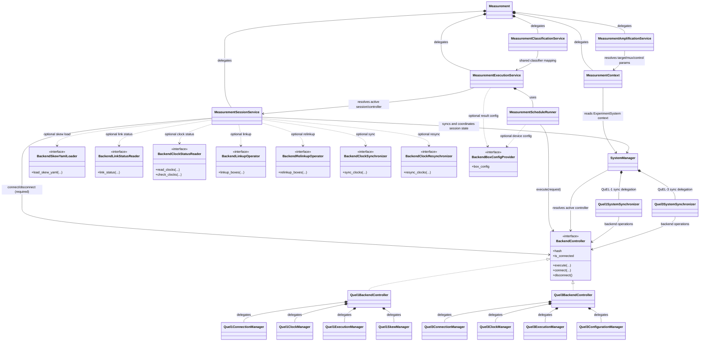
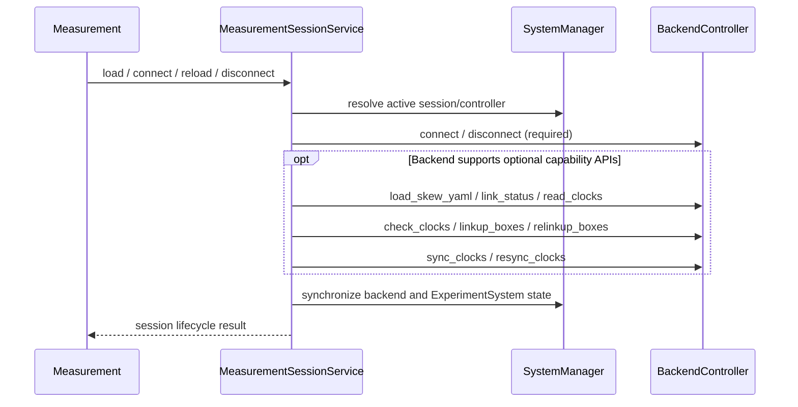
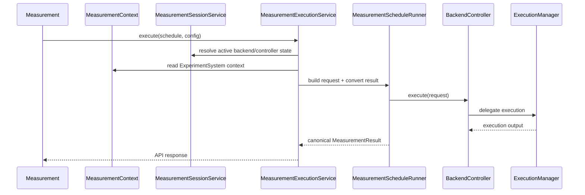

# Measurement Backend Architecture Policy (v1.5.0, Initial Draft)

## Status

- State: `DRAFT-INITIAL`
- Created: 2026-02-22
- Updated: 2026-02-22

## Purpose

Define a shared architecture for QuEL-1 and QuEL-3 measurement execution paths in v1.5.0, with clear class responsibilities, dependency direction, and package layout.

## Scope

- In scope:
  - Measurement execution flow from `Measurement` to canonical `MeasurementResult`.
  - Responsibility boundaries across `measurement` and `backend` layers.
  - Naming and directory structure for controller/manager-centered design.
- Out of scope:
  - User-facing API behavior changes.
  - Hardware protocol details inside qubecalib or quelware integrations.

## Ownership And Dependencies

- `MeasurementConfig`, `MeasurementSchedule`, and `MeasurementResult` are owned by the `measurement` package.
- Allowed dependency directions:
  - `measurement -> backend`
  - `experiment -> measurement`
- `MeasurementExecutionService` owns measurement execution orchestration in the measurement layer.
- `MeasurementClassificationService` owns classifier map updates and confusion-matrix helpers.
- `MeasurementAmplificationService` owns temporary DC-voltage application operations.
- `MeasurementScheduleRunner` is an internal execution component used by
  `MeasurementExecutionService` for request construction and result conversion.
- `MeasurementSessionService` may call `BackendController` directly for
  session/connectivity operations.
- `MeasurementSessionService` uses `SystemManager` for state synchronization and
  active-controller/session coordination.
- Measurement-to-backend execution boundary call is `BackendController.execute(...)`.
- Measurement layer does not depend on backend-internal execution component classes.

## Architecture Overview



## Class Responsibilities

### Measurement Layer

- `Measurement`
  - Public API facade.
  - Owns input/output contract and compatibility surface.
  - Delegates non-API logic to `MeasurementContext`,
    `MeasurementSessionService`, `MeasurementExecutionService`,
    `MeasurementClassificationService`, and `MeasurementAmplificationService`.

- `MeasurementContext`
  - Context provider for measurement features.
  - Provides `ExperimentSystem`-derived information through `SystemManager`.
  - Owns read/query helpers for targets, frequencies, and related context access.
  - Does not resolve active backend/controller session state.

- `MeasurementClassificationService`
  - Classifier-state helper service on measurement side.
  - Owns classifier map update operations and confusion-matrix helper APIs.
  - Provides shared classifier mapping consumed by `MeasurementExecutionService`.

- `MeasurementSessionService`
  - Session lifecycle and connectivity service on measurement side.
  - Owns required session operations: `load`, `connect`, `reload`, `disconnect`.
  - Owns capability-gated operations when supported by backend:
    `check_link_status`, `check_clock_status`, `linkup`, and `relinkup`.
  - Resolves backend optional operations through capability protocols
    (unsupported capabilities are handled by no-op or explicit errors).
  - Calls `BackendController` directly for session/connectivity operations.
  - Uses `SystemManager` for synchronization between backend runtime state and
    `ExperimentSystem`, and for active-controller/session coordination.

- `MeasurementExecutionService`
  - Measurement execution service on measurement side.
  - Owns `create_measurement_config` and `build_measurement_schedule`.
  - Owns runtime-side capability resolution such as
    `sampling_period` and `constraint_profile`.
  - Resolves active backend/controller session state via
    `MeasurementSessionService`.
  - Executes measurement requests through `BackendController.execute(...)`.

- `MeasurementAmplificationService`
  - Temporary amplification/DC operation service on measurement side.
  - Owns target-to-mux resolution and DC-voltage application context handling.
  - Uses `MeasurementContext`/`ExperimentSystem` to resolve control metadata.

- `MeasurementScheduleRunner`
  - Internal execution component used by `MeasurementExecutionService`.
  - Builds backend execution request and converts backend output to canonical result.
  - Does not own measurement-layer use-case orchestration.

### Backend Layer

- `SystemManager`
  - Cross-system state management and synchronization.
  - Owns backend-kind/session selection and active-controller state.
  - Owns pull/push synchronization orchestration and backend selection.
  - Delegates backend-specific sync implementation to `Quel1SystemSynchronizer`
    and `Quel3SystemSynchronizer`.
  - Is not the owner of backend operation implementations.

- `BackendController`
  - Required operation contract for backend controllers.
  - Single entrypoint for device operations from measurement layer.
  - Exposes required operation API to upper layers.

- `Quel1BackendController`, `Quel3BackendController`
  - Concrete backend-controller classes implementing `BackendController` contract.
  - Delegate operation implementations to backend-local managers.

- `Quel{1,3}ConnectionManager`
  - Connection and link-maintenance operations.

- `Quel{1,3}ExecutionManager`
  - Backend execution primitives and backend-local execution routines.

- `Quel1ClockManager`
  - Multi-device clock/synchronization operations (QuEL-1 only).

- `Quel1SkewManager`
  - QuEL-1 skew calibration helpers (`load_skew_yaml`, `run_skew_measurement`).

- `Quel1ConfigurationManager`
  - Backend-side configuration and definition operations.

- `Quel1SystemSynchronizer`, `Quel3SystemSynchronizer`
  - SystemManager delegation targets for backend-specific synchronization flows.
  - May consume backend-controller APIs as device-operation gateway.

## BackendController Required Methods

`BackendController` is the measurement-facing backend contract.
Concrete classes (`Quel1BackendController`, `Quel3BackendController`) must provide these methods/properties.

- Required now
  - `hash`
  - `is_connected`
  - `sampling_period`
  - `execute(...)`
  - `connect(...)`
  - `disconnect()`
- Optional capabilities (backend dependent, provided via separate protocols)
  - `BackendSkewYamlLoader.load_skew_yaml(...)`
  - `BackendLinkStatusReader.link_status(...)`
  - `BackendClockStatusReader.read_clocks(...)`
  - `BackendClockStatusReader.check_clocks(...)`
  - `BackendLinkupOperator.linkup_boxes(...)`
  - `BackendRelinkupOperator.relinkup_boxes(...)`
  - `BackendClockSynchronizer.sync_clocks(...)`
  - `BackendClockResynchronizer.resync_clocks(...)`
  - `BackendBoxConfigProvider.box_config`
- Expansion policy
  - Start from the minimum shared contract for QuEL-1 and QuEL-3.
  - `load` and `reload` are session-level operations owned by
    `MeasurementSessionService`/`SystemManager`, not backend-controller methods.
  - Add additional required methods only after confirming they are truly common
    across both backends.
  - Keep backend-specific operations outside the shared required-method list until the common contract is stable.
  - Capability APIs remain separate from `BackendController` and are resolved only when needed.

## Execution Contract

- `MeasurementExecutionService` is the measurement-layer execution owner and orchestrator.
- `MeasurementScheduleRunner` is a non-owning internal execution component used by
  `MeasurementExecutionService` for request construction and result conversion.
- `MeasurementExecutionService` resolves active backend/controller state through `MeasurementSessionService`.
- The cross-layer boundary call from measurement to backend is `BackendController.execute(...)`.
- Backend-internal execution decomposition is not part of the measurement-layer contract.

## Measurement API Delegation Map

| `Measurement` API | Delegate |
| --- | --- |
| `load`, `connect`, `reload` | `MeasurementSessionService` |
| `disconnect` | `MeasurementSessionService` |
| `check_link_status`, `check_clock_status`, `linkup`, `relinkup` | `MeasurementSessionService` (capability-gated via backend capability protocols) |
| `execute_measurement_schedule`, `execute`, `measure`, `measure_noise` | `MeasurementExecutionService` |
| `create_measurement_config`, `build_measurement_schedule` | `MeasurementExecutionService` |
| `sampling_period`, `constraint_profile` | `MeasurementExecutionService` |
| `apply_dc_voltages` | `MeasurementAmplificationService` |
| `chip_id`, `targets`, `control_params` | `MeasurementContext` |
| `nco_frequencies`, `awg_frequencies`, `get_awg_frequency`, `get_diff_frequency` | `MeasurementContext` |
| `experiment_system` and other ExperimentSystem-derived context queries | `MeasurementContext` |
| classifier APIs and confusion-matrix APIs | `MeasurementClassificationService` |

## Session Lifecycle Sequence



## Execution Path Sequence



## Directory Structure (Target)

```text
src/qubex/
  backend/
    system_manager.py
    quel1/
      quel1_backend_controller.py
      quel1_runtime_context.py
      managers/
        execution_manager.py
        connection_manager.py
        clock_manager.py
        skew_manager.py
      compat/
        box_adapter.py
        driver_loader.py
        qubecalib_protocols.py
        sequencer.py
        capture_result_parser.py
        parallel_action_builder.py
        sequencer_execution_engine.py
    quel3/
      quel3_backend_controller.py
      quel3_runtime_context.py
      managers/
        execution_manager.py
        connection_manager.py
        sequencer_builder.py
  measurement/
    measurement.py
    measurement_context.py
    measurement_session_service.py
    measurement_execution_service.py
    measurement_schedule_runner.py
    adapters/
    models/
      measurement_config.py
      measurement_schedule.py
      measurement_result.py
```

## Naming Baseline

- API facade: `Measurement`
- Context provider: `MeasurementContext`
- Session lifecycle service: `MeasurementSessionService`
- Execution service: `MeasurementExecutionService`
- Internal execution component: `MeasurementScheduleRunner`
- Backend operation contract: `BackendController`
- Concrete backend controllers: `Quel1BackendController`, `Quel3BackendController`
- Backend feature managers:
  `Quel{1,3}ExecutionManager`, `Quel{1,3}ConnectionManager`,
  `Quel1ClockManager`, `Quel1SkewManager`

## Acceptance Criteria (v1.5.0)

- `Measurement` remains API-focused and delegates non-API logic.
- `MeasurementContext` provides `ExperimentSystem`-based context through `SystemManager`.
- `MeasurementSessionService` owns required session operations (`load`, `connect`,
  `reload`, `disconnect`).
- `MeasurementSessionService` supports `check_*`/`linkup`/`relinkup` as
  capability-gated APIs when backend supports them.
- `MeasurementExecutionService` owns measurement execution and calls `BackendController.execute(...)`.
- `SystemManager` remains focused on state synchronization.
- `Quel1BackendController` and `Quel3BackendController` implement required `BackendController` methods.
- `Quel3BackendController` is implemented natively through `quelware-client` (no QuEL-1 control-plane delegation).
- QuEL-1 and QuEL-3 controllers follow the same manager-delegation structure.
- Backend internal execution details are hidden from measurement layer.
- Measurement contract types remain owned by the `measurement` package.
