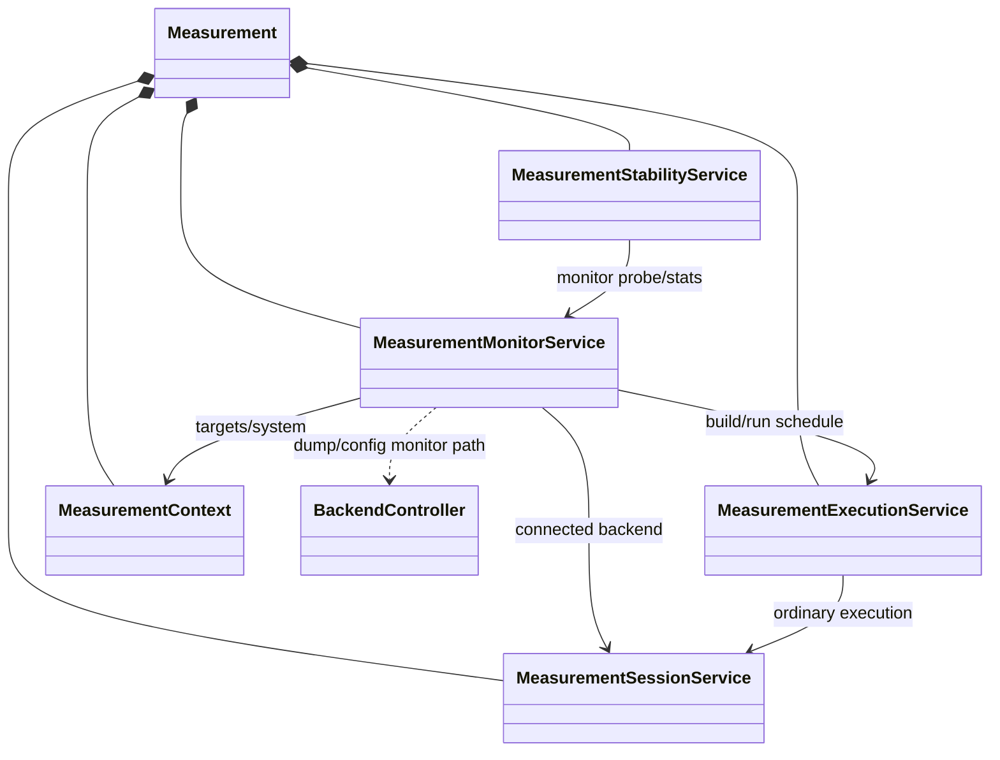

# Measurement Monitor Service Design

## Status

- State: `DRAFT`
- Created: 2026-06-26
- Motivation: replace the monitor-heavy changes from
  `feature/monitor-port-output` with a smaller responsibility split.

## Problem

Monitor loopback capture is not ordinary measurement execution. It needs to
resolve physical loopback wiring, receiver LO/CNCO/FNCO settings, RF switch
state, and software demodulation. Putting those rules inside
`MeasurementExecutionService` makes the service responsible for too many
hardware-specific details.

The frequency setting rules are also box-type dependent:

- Some boxes have monitor receiver LO independent from control outputs.
- Some boxes share an LO between an output line and an input or monitor line.
- Some control outputs, such as QuEL-1 SE RIKEN8 low-frequency control ports,
  have no analog LO and generate directly with DAC CNCO/FNCO.
- Monitor capture units may not provide backend DSP demodulation, so Qubex must
  software-demodulate after capture.

A monitor implementation must therefore be safe by construction: it must not
change any LO/NCO setting that can perturb the active control or readout output
being monitored.

## Goals

- Move monitor loopback capture from `MeasurementExecutionService` into a new
  `MeasurementMonitorService`.
- Move monitor receiver setup, loopback source resolution, and software
  demodulation into `MeasurementMonitorService`.
- Keep `MeasurementExecutionService` focused on normal schedule construction and
  execution.
- Keep `MeasurementStabilityService` focused on high-level stability workflows:
  target selection, baselines, repeated checks, plotting, and correction updates.
- Resolve monitor LO/NCO settings from connected hardware state, not from stale
  pre-connect model state.
- Make box-type-specific monitor safety rules explicit and testable.

## Non-Goals

- Do not add generic output calibration logic to `MeasurementMonitorService`.
- Do not hide hardware side effects behind a best-effort monitor capture.
- Do not configure an output port as part of monitor setup.
- Do not rely on private quelware tables long-term without an adapter boundary.
  Private tables may be used initially, but Qubex should wrap them behind a
  backend capability.

## Target Ownership



### MeasurementExecutionService

Owns ordinary measurement execution:

- `build_measurement_schedule`
- `run_measurement`
- `measure`
- sweep execution
- measurement config creation
- result conversion

It should not own:

- monitor loopback source grouping
- monitor receiver LO/CNCO/FNCO setup
- monitor RF switch safety policy
- monitor-specific software demodulation
- stability baseline/correction state

### MeasurementMonitorService

Owns monitor-path acquisition:

- `capture_loopback(...)`
- default capture target resolution for monitor/read-in loopback
- physical loopback source resolution
- monitor receiver setup planning and optional programming
- RF switch setup for loopback capture
- monitor software demodulation
- low-level monitor probe statistics when needed by stability workflows

The service may call `MeasurementExecutionService` to build and run an ordinary
measurement schedule. The execution service remains unaware that the schedule is
being used for monitor capture.

### MeasurementStabilityService

Owns stability semantics:

- output target selection for stability checks
- flat-top probe construction policy
- baseline snapshots
- gain/phase correction table
- repeated monitoring loop
- live plotting
- correction update rules and deadbands

It calls `MeasurementMonitorService` for the monitor acquisition primitive.

## Connected Hardware Is The Source Of Truth

Monitor planning must require connected hardware when it may program hardware or
compute a receiver plan. Pre-connect `ExperimentSystem` model values can differ
from the connected box state after link-up, reload, relink, or manual tuning.

Rules:

- If `configure_receiver=True`, require `session_service.is_connected`.
- Read current values through `dump_box` or `dump_port` after `connect()`.
- Use connected target/channel state after synchronization, not constructor-time
  values.
- If the caller requests a dry-run plan while disconnected, mark it explicitly as
  model-derived and do not use it for hardware programming.

This rule is required because a target such as `Q036` can have different
pre-connect and post-connect source CNCO/FNCO values.

## Monitor Hardware Profile

`MeasurementMonitorService` should not hard-code a single LO/NCO strategy. It
should resolve a `MonitorHardwareProfile` from the active backend and box type.

Suggested profile fields:

```python
@dataclass(frozen=True)
class MonitorHardwareProfile:
    box_type: str
    port_to_group_line: Mapping[int | tuple[int, int], tuple[int, int | str]]
    lo_groups: Mapping[tuple[int, int | str], tuple[int, int]]
    adc_indices: Mapping[tuple[int, str], tuple[int, int]]
    adc_channel_indices: Mapping[tuple[int, str], tuple[tuple[int, int], ...]]
    adc_converter_hz: Mapping[int, int]
    adc_main_decimation: Mapping[int, int]
```

The profile lets monitor planning answer:

- Which physical receiver line corresponds to the capture port?
- Which other lines share the same LO IC?
- Does changing this monitor LO affect an output line?
- What are the ADC-CNCO and ADC-FNCO ranges?
- Which capture runit is used for monitor data?

For QuEL-1-family backends this can initially be populated from the connected
quelware box object, but it should be exposed through a backend capability such
as `get_monitor_hardware_profile(box_name)`.

## LO Ownership Policy

The central safety rule is:

`MeasurementMonitorService` may change a receiver LO only when no active output
line shares that LO, unless the caller explicitly opts into that side effect.

The default monitor policy should be `preserve_output`.

Under `preserve_output`:

1. Determine the capture receiver line.
2. Determine the LO IC shared by that receiver line.
3. Find all lines that share that LO.
4. If any shared line is an output line, treat the LO as output-owned.
5. Do not change output-owned LO.
6. Prefer solving the monitor frequency with the current LO, receiver CNCO,
   receiver FNCO, and residual software demodulation.
7. If no legal solution exists, raise an explicit error instead of changing the
   shared LO.

Changing receiver CNCO/FNCO is allowed only for the receiver line being captured
and only inside the setting range.

## Box-Type Notes

### QuEL-1 SE RIKEN8

Observed on `S135R` after `connect()`:

- `MNTR0.IN` and `MNTR1.IN` share the same monitor LO IC.
- Monitor LO is separate from readout LO.
- Monitor CNCO/FNCO are independent per monitor input.
- Low-frequency CTRL ports have no analog LO.

Implications:

- Changing monitor LO does not directly change readout LO.
- Changing monitor LO affects both monitor inputs.
- It is safe from a control-output perspective to change monitor LO, but the
  default should still preserve the current monitor LO to avoid perturbing
  simultaneous monitor users.
- Do not use `cnco_locked_with` from an LO-less CTRL port. The CTRL DAC-CNCO is
  not a legal monitor ADC-CNCO setting.

For `S135R` the connected AD9082 state has:

- ADC converter clock: `6 GHz`
- main decimation: `6`
- ADC-CNCO hard range: `[-3 GHz, 3 GHz)`
- ADC-FNCO hard range: `[-500 MHz, 500 MHz)`

The manual/docstring operating convention may be narrower than the hard FTW
range. The planner should prefer documented operating ranges when available and
use hard ranges only as validation limits.

### QuEL-1 / QuBE Type A and Type B

Several QuEL-1 and QuBE profiles map input or monitor lines to the same LO IC as
output lines. For these boxes, changing monitor or read-in LO can change the
corresponding output LO.

Implications:

- Treat a shared output/input LO as output-owned.
- Never change that LO in default monitor capture.
- Use current LO plus receiver CNCO/FNCO and software demodulation.
- If the requested monitor frequency cannot be observed legally without moving
  the shared LO, return a clear planning error.

This is the case that motivates making the monitor frequency resolver
box-type-specific.

## Receiver Frequency Planning

For each monitor capture, build a plan:

```python
@dataclass(frozen=True)
class MonitorReceiverPlan:
    box_name: str
    capture_target: str
    capture_port: int | tuple[int, int]
    source_label: str | None
    source_rf_hz: float | None
    lo_hz: int | None
    cnco_hz: int | None
    fnco_hz: int | None
    software_demod_hz: float | None
    lo_action: Literal["preserve", "set", "forbidden"]
    cnco_action: Literal["preserve", "set"]
    fnco_action: Literal["preserve", "set"]
    side_effects: tuple[str, ...]
```

Planning algorithm:

1. Resolve the source target and physical source port from the pulse schedule.
2. Resolve the monitor input port through loopback wiring.
3. Read current capture-port dump after `connect()`.
4. Resolve the RF frequency that should be observed.
5. Classify LO ownership from the hardware profile.
6. Choose LO:
   - preserve current LO if it is output-owned;
   - otherwise preserve current LO by default;
   - change monitor-exclusive LO only when requested or needed and safe.
7. Choose receiver CNCO/FNCO within range.
8. Compute residual software demodulation frequency.
9. Program only the receiver settings selected by the plan.

The service should expose a dry-run method:

```python
plan_monitor_capture(
    schedule: PulseSchedule,
    capture_targets: list[str] | None = None,
    *,
    policy: MonitorReceiverPolicy = "preserve_output",
) -> list[MonitorReceiverPlan]
```

## Demodulation Rule

Software demodulation must use the receiver plan, not only the source NCO.

The residual frequency is the difference between the signal RF and the receiver
frequency actually selected by LO/CNCO/FNCO. The exact sign should be verified
with a short hardware test per backend path and then locked with a regression
test using synthetic complex tones.

For monitor inputs without backend DSP, software demodulation is applied after
capture. For read-in inputs with backend DSP, the monitor service should keep
the existing backend demodulation path unless explicitly asked for raw data.

## Public API Shape

`Measurement` should continue to expose a compact facade:

```python
measurement.capture_loopback(...)
measurement.check_signal_stability(...)
```

Delegation:

- `Measurement.capture_loopback` -> `MeasurementMonitorService.capture_loopback`
- `Measurement.check_signal_stability` ->
  `MeasurementStabilityService.check_signal_stability`
- `MeasurementStabilityService` -> `MeasurementMonitorService`

`MeasurementExecutionService.capture_loopback` should be removed after the
facade has been delegated to `MeasurementMonitorService`.

## Migration Plan

1. Add `measurement_monitor_service.py` and wire it into `Measurement`.
2. Move loopback-only dataclasses and helpers out of
   `MeasurementExecutionService`.
3. Move `capture_loopback` into `MeasurementMonitorService`.
4. Add connected-hardware receiver planning and dry-run plan API.
5. Add a backend monitor-profile capability for QuEL-1.
6. Move software demodulation into `MeasurementMonitorService` and base it on
   `MonitorReceiverPlan`.
7. Update `MeasurementStabilityService` to consume the monitor service instead
   of accepting an arbitrary loopback callable.
8. Remove monitor-specific code from `MeasurementExecutionService`.
9. Split tests into:
   - execution service tests for ordinary execution;
   - monitor service tests for loopback capture and receiver planning;
   - stability service tests for baseline/correction behavior.

## Test Plan

Unit tests:

- RIKEN8 profile marks `MNTR0.IN` and `MNTR1.IN` as sharing monitor LO.
- RIKEN8 profile marks monitor LO as not shared with readout or CTRL outputs.
- Type A/B-style profiles mark monitor/read-in LO as output-owned when shared
  with an output line.
- The planner does not change output-owned LO under `preserve_output`.
- The planner raises when no legal CNCO/FNCO/software-demod solution exists
  without moving output-owned LO.
- LO-less CTRL sources never use `cnco_locked_with`.
- Software demodulation uses receiver-plan residual frequency.
- Disconnected hardware planning raises unless explicitly requested as dry-run.

Hardware validation:

- On SE RIKEN8, dump monitor/readout/CTRL ports before and after monitor capture
  and confirm no CTRL/readout settings changed.
- On a Type B box, confirm monitor capture does not change CTRL LO when the LO
  is shared.
- On `Q036`, verify that the latest monitor waveform stops rotating after
  receiver-plan residual software demodulation.

## Open Questions

- Should monitor-exclusive LO changes be allowed by default, or only through an
  explicit `allow_monitor_lo_change=True` option?
- Should monitor plans be cached for repeated stability sampling, or recomputed
  every sample from `dump_port`?
- Should low-level monitor statistics live in `MeasurementMonitorService`, or
  should the monitor service return only demodulated waveforms and leave all
  statistics to `MeasurementStabilityService`?
- What public backend capability should expose LO sharing and NCO range without
  leaking quelware private attributes?
